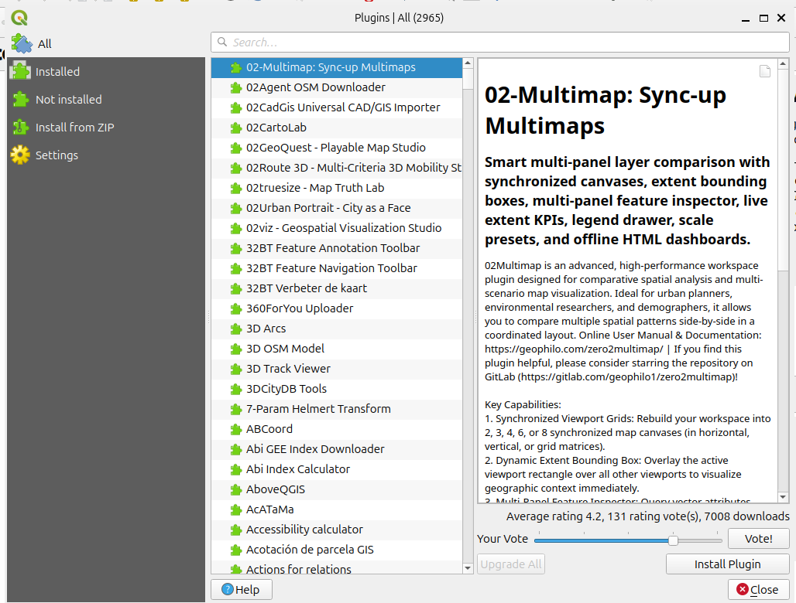
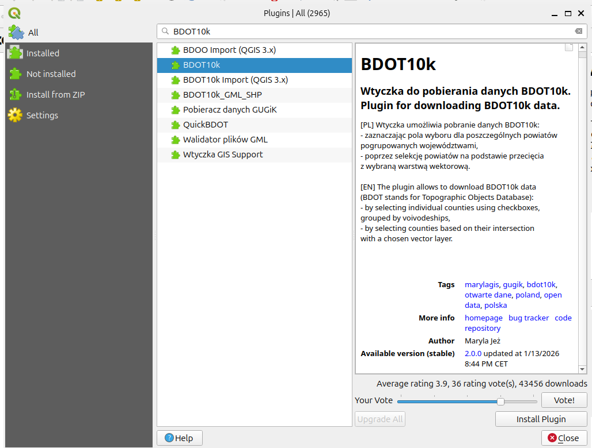

#WAVE
[[pl]]

---
# !!!UWAGA!!!

Poradnik na dzień dzisiejszy obsługuje wyłącznie  Polskę i oprogramowanie QGIS. W przyszłości planowane jest dodanie innych krajów i innych programów.

---
# 1. Przygotowanie środowiska
 1. Zainstaluj program QGIS, jest on wymagany w tym porandiku. 
	[Oficjalna strona pobierania QGIS](https://qgis.org/resources/installation-guide/)
	Nie potrzebujesz żadnego dodatkowego oprogramowania. 
	Nie potrzebujesz przechodzić oficjalnych poradników QGIS, ten poradnik przeprowadzi cię krok po kroku po wszystkch kolejnych kliknięciach. QGIS to bardzo zaawansowane środowisko, na potrzeby WMCP nie potrzeba się go uczyć, użyjemy tylko niewielkiej części jego funkcji.
 2. Włącz QGIS. Po włączeniu powinien wyglądać mniej więcej tak:
   

# 2. Zainstaluj wtyczkę BDOT10k

 1. Na górnym pasku kliknij Plugins -> Manage and Insall Plugins...
   Wyświetli się takie okienko:
   
   
   
 2. W pol *Search ...* należy pisać BDOT10k i wbrać plugin o dokładnie tej nazwie. Autorem jest Maryla Jeż.
 
   
   
 3. Zainstaluj ten plugin i zamknij to okno, nie będziemy potrzebować więcej. 
