# WAVE

[[pl]]

---

# !!! UWAGA !!!

Poradnik na dzień dzisiejszy obsługuje wyłącznie Polskę i oprogramowanie QGIS. W przyszłości planowane jest dodanie innych krajów i innych programów.

---

# 1. Przygotowanie środowiska

1. Zainstaluj program QGIS, jest on wymagany w tym poradniku.
    
    [Oficjalna strona pobierania QGIS](https://qgis.org/resources/installation-guide/)
    
    Nie potrzebujesz żadnego dodatkowego oprogramowania.
    
    Nie potrzebujesz przechodzić oficjalnych poradników QGIS — ten poradnik przeprowadzi Cię krok po kroku przez wszystkie kolejne czynności. QGIS to bardzo zaawansowane środowisko, jednak na potrzeby WMCP nie trzeba go poznawać w całości. Użyjemy tylko niewielkiej części jego funkcji.
    
2. Włącz QGIS. Po włączeniu powinien wyglądać mniej więcej tak:
    
    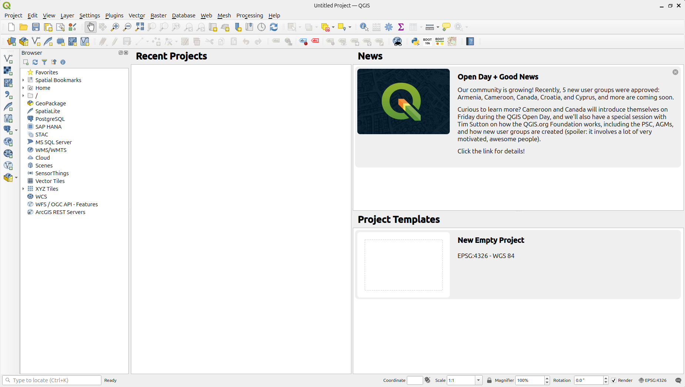
    

# 2. Zainstaluj wtyczkę BDOT10k

1. Na górnym pasku kliknij **Plugins → Manage and Install Plugins...**
    
    Wyświetli się takie okienko:
    
    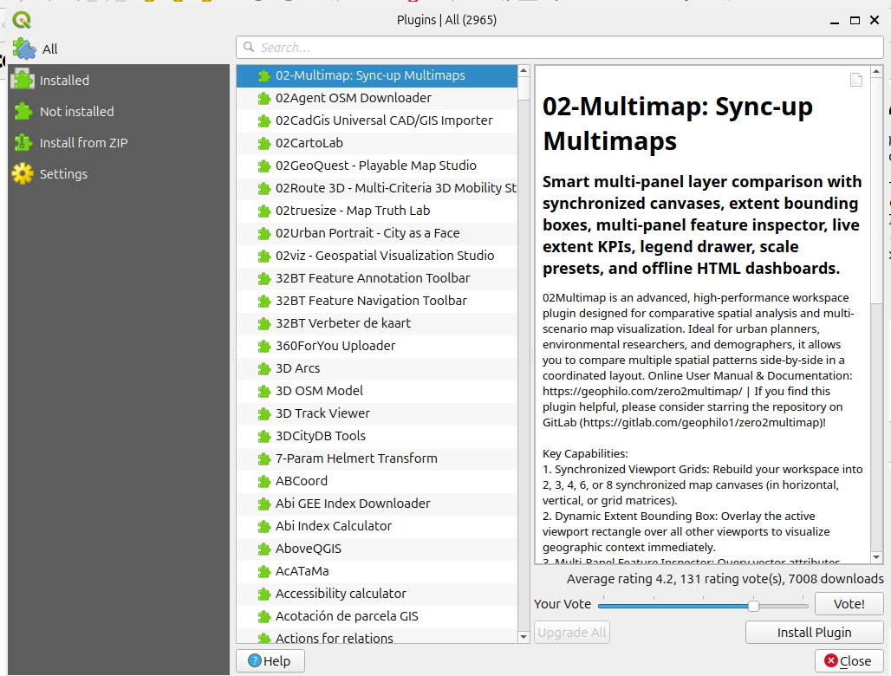
    
2. W pole _Search..._ należy wpisać **BDOT10k** i wybrać plugin o dokładnie tej nazwie. Autorem jest Maryla Jeż.
    
    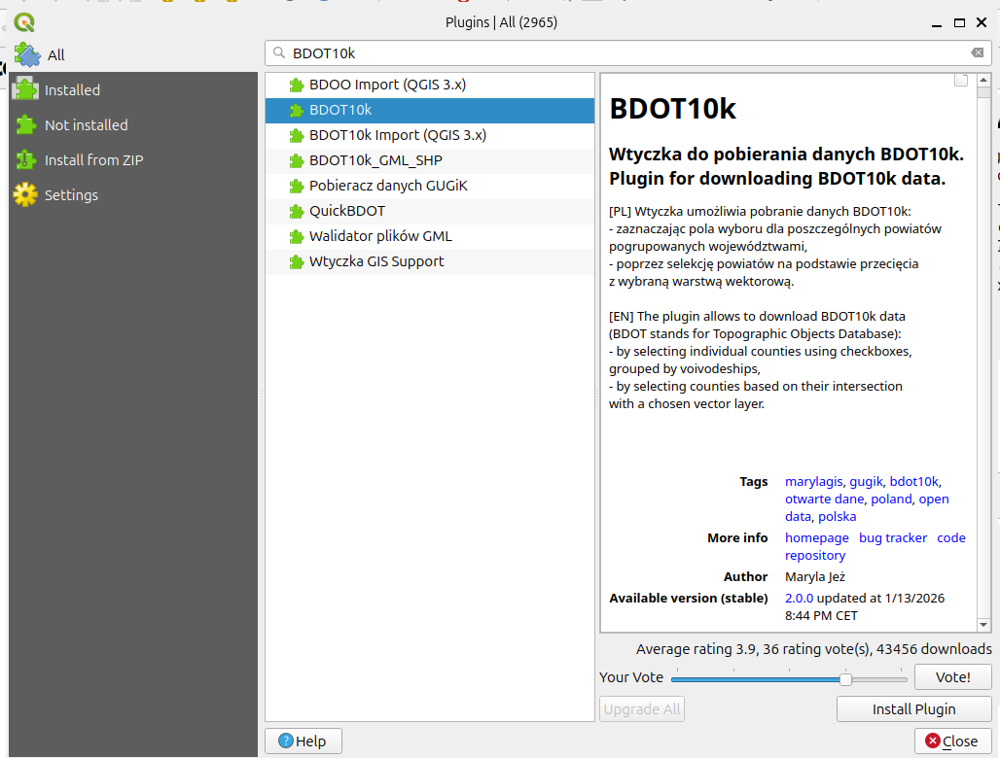
    
3. Zainstaluj ten plugin i zamknij okno — nie będziemy go już potrzebować.
    
    BDOT10k to **Baza Danych Obiektów Topograficznych** w skali 1:10 000. Są to oficjalne dane udostępniane przez Główny Urząd Geodezji i Kartografii. Ten plugin jest jednym ze sposobów na ich pobranie.
    

# 3. Pobierz paczkę BDOT10k

Teraz musimy pobrać odpowiednie dane.

1. Na górnym pasku pojawiły się dwa przyciski, na zdjęciu zaznaczone czerwonym kółkiem.
    
    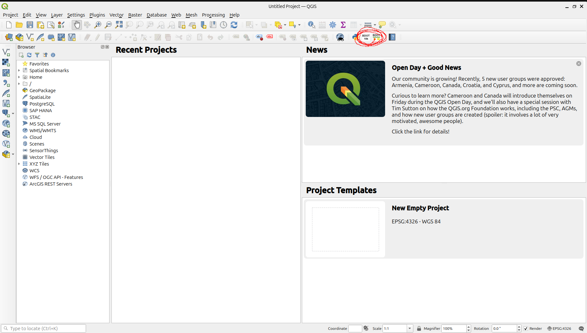
    
    Otworzy się wtedy kolejne okno. Należy tam wybrać interesujący nas powiat lub powiaty. U mnie wybieram część Pojezierza Warmińsko-Mazurskiego.
    
1. 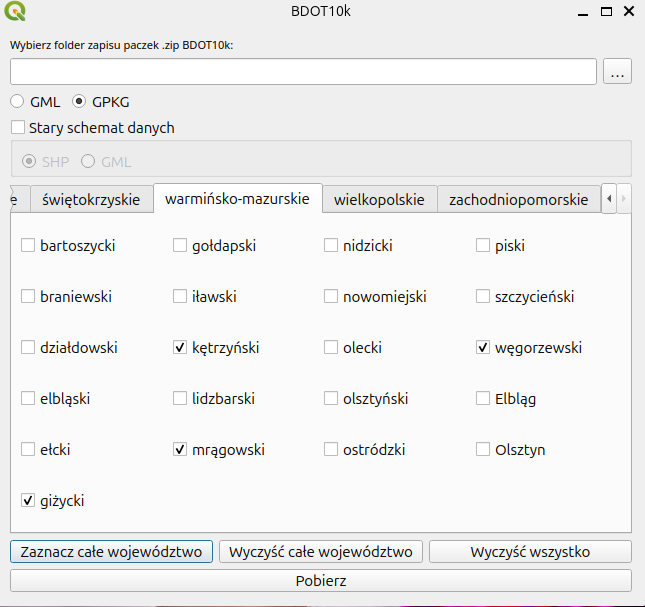
    
    Wybierz folder pobierania danych. Ważne, żeby wybrać u góry opcję **GPKG**.
    
    Kliknij opcję **Pobierz**. Zostaną pobrane foldery `.zip`, które należy rozpakować.
    
2. **Uwaga:** po rozpakowaniu paczki `.gpkg` mają dość pokaźne rozmiary. Dla przykładu te cztery powiaty, które pobrałem, to około 900 MB. Na szczęście nie potrzebujemy tego wszystkiego.
    
    Potrzebujemy z każdej paczki tylko kilku konkretnych warstw, resztę można usunąć. Potrzebujemy konkretnie:
    
    - `PL.PZGiK.341.BDOT10k.XXXX_OT_SWRS_L` — sieć wodna — rzeki
        
    - `PL.PZGiK.341.BDOT10k.XXXX_OT_SWKN_L` — sieć wodna — kanały
        
    - `PL.PZGiK.341.BDOT10k.XXXX_OT_SWRM_L` — sieć wodna — rowy melioracyjne
        
    - `PL.PZGiK.341.BDOT10k.XXXX_OT_PTWP_A` — pokrycie terenu — wodą powierzchniową (**najważniejsze**)
        
    
    Resztę można spokojnie usunąć, nie są do niczego potrzebne w tym przypadku.
    
    Oto krótki skrypt w Bashu, który usunie pozostałe pliki poza tymi czterema:
    
    `find . -maxdepth 1 -type f ! -name '*_OT_SWRS_L*' ! -name '*_OT_SWKN_L*' ! -name '*_OT_SWRM_L*' ! -name '*_OT_PTWP_A*' -delete`
    
    Aby go użyć, należy odpalić konsolę w Linuxie, wejść do katalogu, w którym znajdują się rozpakowane pliki, i wkleić w konsolę ten kod.
    
    **Wersja PowerShell (konsola Windows):**
    
    `Get-ChildItem -File | Where-Object { $_.Name -notlike '*_OT_SWRS_L*' -and $_.Name -notlike '*_OT_SWKN_L*' -and $_.Name -notlike '*_OT_SWRM_L*' -and $_.Name -notlike '*_OT_PTWP_A*' } | Remove-Item`
    

# 4. Przygotuj projekt

W QGIS kliknij dwa razy **New Empty Project**. Wyświetli się taki widok:

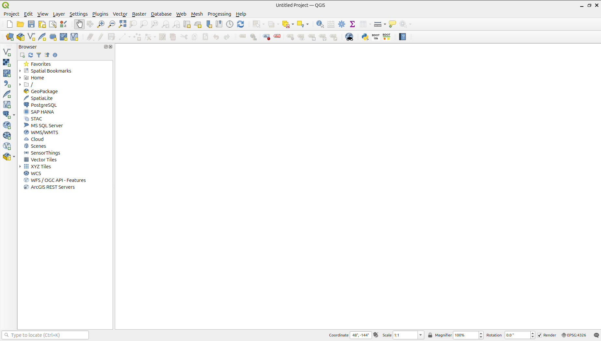

Następnie w górnym pasku wybierz opcję **Layer → Add Layer → Add Vector Layer**.

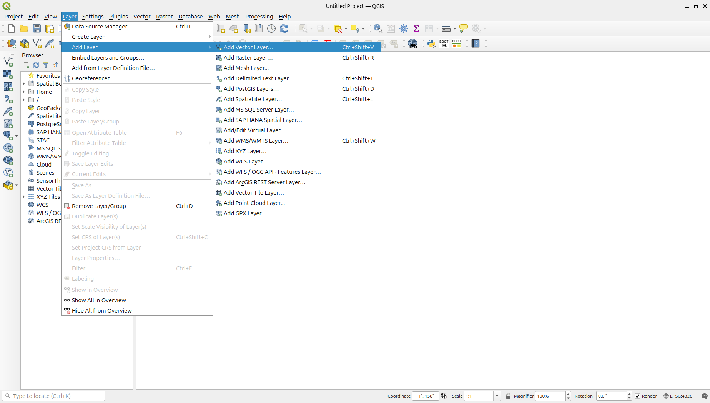

Pojawi się wtedy takie okienko:

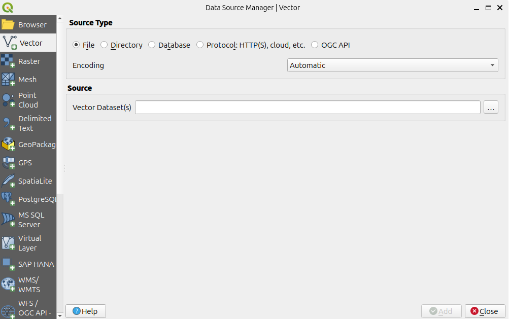

W okienku **Vector Dataset(s)** kliknij trzy kropki i wybierz wszystkie potrzebne Ci pliki GPKG, dokładnie te z dopiskami, które wypisałem wyżej. Potem kliknij **Add** i **Close**.

Powtórz to dla każdego folderu.

Następnie na panelu po lewej kliknij **XYZ Tiles → OpenStreetMap** (2 razy). Powinna się wyświetlić mapa podkładowa OSM, jednak nałożona **nad** wszystkimi warstwami.

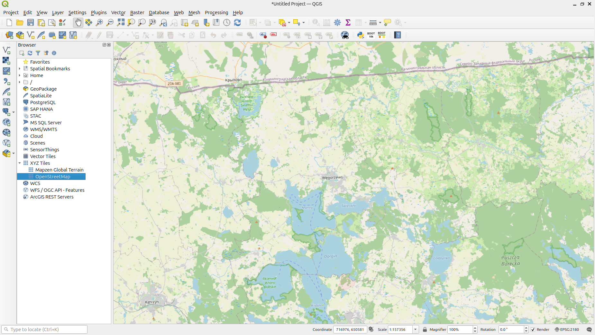

Aby ustawić to prawidłowo, kliknij **View → Panels** i zaznacz **Layers**.

Pojawi się panel. Należy przesunąć warstwę **OpenStreetMap** na sam dół.

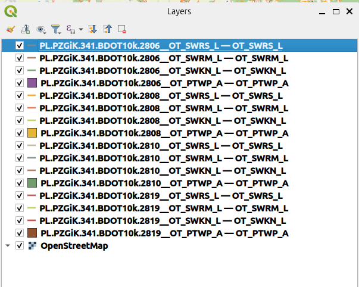

# 5. Obróbka danych i dokładne przygotowanie misji

Dalej pokażę to na przykładzie jeziora Gołdapiwo.

Porównaj kolor wybranego przez siebie jeziora, rzeki lub innego zbiornika wodnego i wybierz go na liście w panelu **Layers**.

Następnie na górnym pasku zaznacz ikonkę **Select Features by Area or Single Click** i kliknij na to jezioro. Powinno zmienić kolor na żółty.

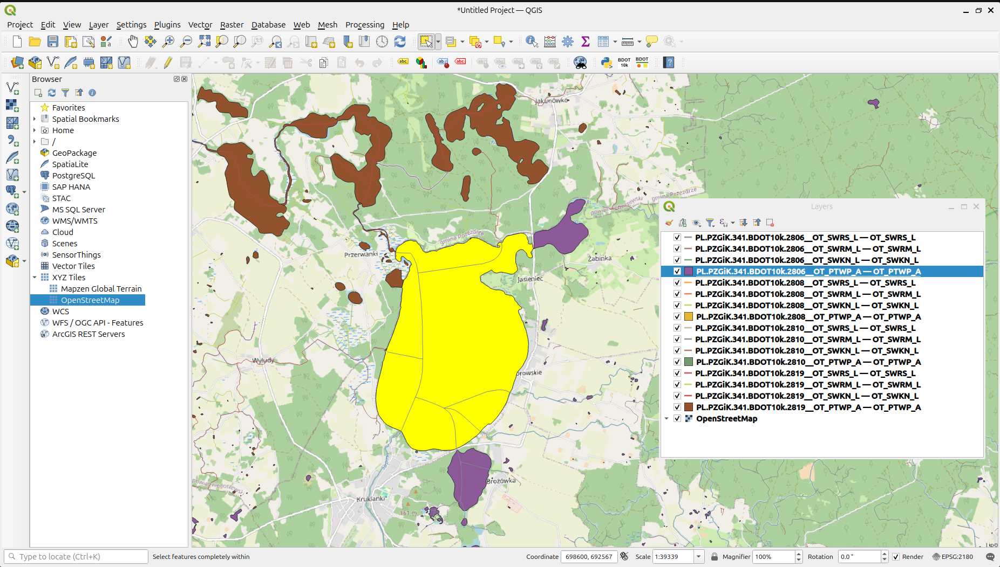

Następnie kliknij prawym przyciskiem myszy na zaznaczoną warstwę i wybierz **Export → Save Selected Features As...**

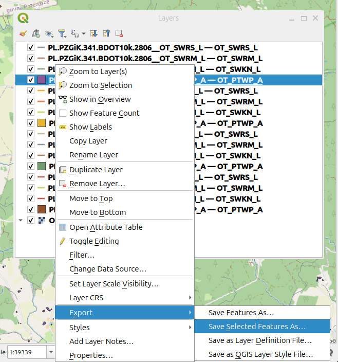

Nazwij warstwę `mission_area`.

Przesuń ją na samą górę.

Następnie upewnij się, że warstwa `mission_area` jest zaznaczona w panelu warstw i kliknij **Vector → Geoprocessing Tools → Buffer**.

Wyskoczy okienko specyfikacji buforu. Proponuję takie ustawienia:

- **Distance:** `-10 m`
    
- **Segments:** `20`
    
- **Dissolve:** zaznaczone
    
- Reszty nie zmieniaj.
    

Ujemna wartość powoduje zmniejszenie obszaru jeziora o 10 metrów od brzegu. Dzięki temu punkty pomiarowe i trasa ASV nie znajdują się bezpośrednio przy brzegu.

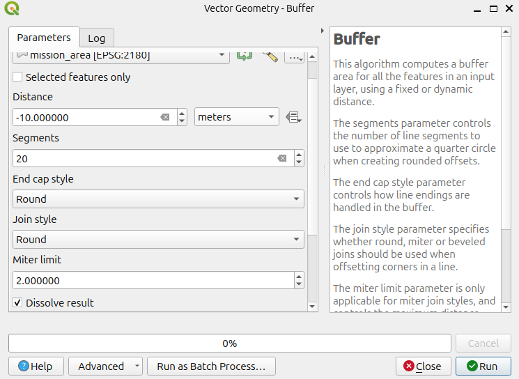

Kliknij **Run** i zamknij okno.

Następnie wybierz warstwę buforu w panelu warstw i kliknij **Processing → Toolbox**. Wyszukaj narzędzie **Create Grid**.

Sugeruję następujące ustawienia:

- **Grid type:** `Point`
    
- **Grid Extent:** wybierz `Buffered` albo jakkolwiek nazwałeś warstwę, na której znajduje się bufor.
    
- **Horizontal Spacing:** `25 m`
    
- **Vertical Spacing:** `25 m`
    
- **Grid CRS:** `EPSG:2180`
    
- Reszty nie zmieniaj.
    

`25 m` jest wartością przykładową. Dla dokładniejszych pomiarów można zastosować mniejszy odstęp, co zwiększy liczbę punktów i czas wykonywania misji.

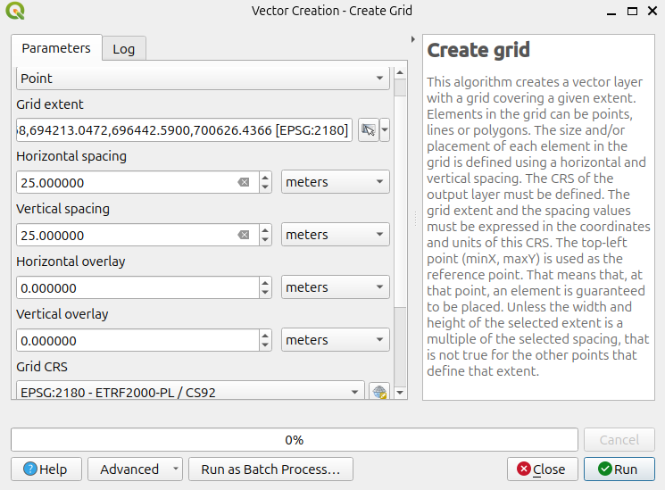

Kliknij **Run**.

Pojawią się punkty rozmieszczone na prostokątnej siatce obejmującej cały obszar buforu. Część z nich będzie znajdować się poza jeziorem. Trzeba teraz usunąć te punkty.

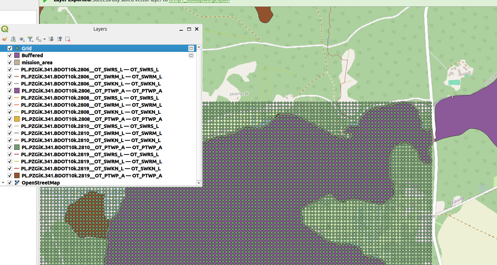

Kliknij po kolei **Processing → Toolbox** i wyszukaj narzędzie **Extract by location**.

Ustaw:

- **Extract features from:** `Grid` (albo inną nazwę, którą nadałeś siatce punktów)
    
- **Geometric predicate:** `within`
    
- **By comparing to the features from:** `Buffered` (albo inną nazwę, którą nadałeś warstwie buforu)
    

Kliknij **Run**.

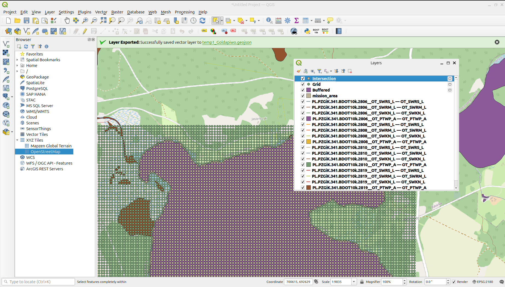

**UWAGA:** w przypadku dużej liczby punktów może to trochę potrwać.

Sprawdź na mapie, czy wszystkie otrzymane punkty znajdują się wewnątrz warstwy `Buffered`.

Otrzymana warstwa zawiera już tylko punkty znajdujące się wewnątrz przygotowanego obszaru.

W zasadzie gotowe. Pozostaje tylko wyeksportować odpowiednie dane, czyli warstwy `Extracted`, `mission_area` i `Buffered`.

# 6. Eksport do GeoPackage

Kliknij po kolei **Processing → Toolbox**, w wyszukiwarkę wpisz **Package layers** i wybierz **Package layers**.

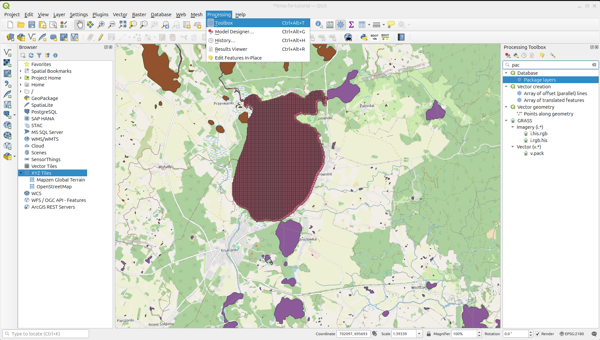

Wyświetli się okno. W **Input Layers** kliknij trzy kropki i zaznacz `Buffered`, `Extracted` i `mission_area`, albo jakkolwiek je nazwałeś.

Potem kliknij **OK**.

Następnie w **Destination GeoPackage** wybierz miejsce, w którym chcesz zapisać plik, i utwórz plik z rozszerzeniem `.gpkg`.

Kliknij **Run**.

I gotowe. Masz przygotowane dane dla misji na jeziorze Gołdapiwo, zapisane w jednym pliku GeoPackage.

W pliku znajdują się trzy warstwy:

- `mission_area` — pierwotny obszar wybranego zbiornika wodnego,
    
- `Buffered` — obszar pomniejszony o 10 metrów od brzegu, przeznaczony do planowania misji,
    
- `Extracted` — punkty pomiarowe znajdujące się wewnątrz przygotowanego obszaru.
    

Tak przygotowany GeoPackage może zostać następnie wczytany do WMCP, gdzie punkty pomiarowe zostaną wykorzystane do zaplanowania trasy ASV.
